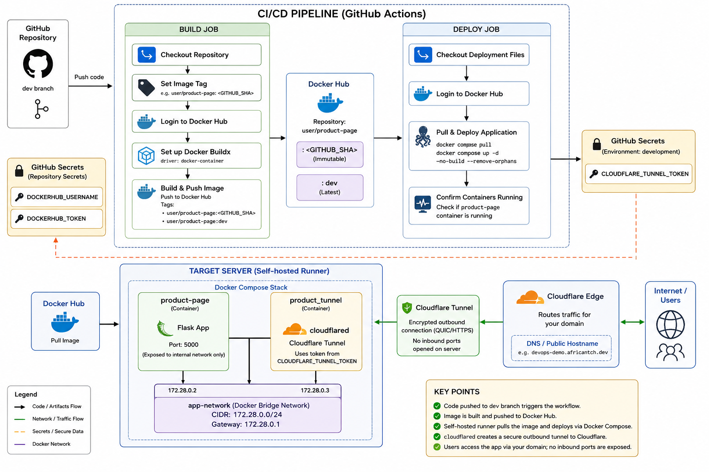

# Orbit — Flask Product Page

A Flask-based product landing page deployed via a fully automated CI/CD pipeline using GitHub Actions, Docker Hub, and Cloudflare Tunnel. No inbound ports are opened on the server — all traffic is routed securely through Cloudflare's edge network.

---

## Architecture



The pipeline has two jobs:

| Job | Runner | What it does |
|---|---|---|
| **build** | self-hosted | Builds the Docker image and pushes it to Docker Hub with two tags: `:<GITHUB_SHA>` (immutable) and `:dev` (latest) |
| **deploy** | self-hosted | Pulls the immutable image by SHA and brings the Docker Compose stack up on the target server |

The target server runs two containers on a private Docker bridge network (`app-network`):

- **product-page** — Flask app exposed on port 5000 (internal network only)
- **product_tunnel** — `cloudflared` container that creates an encrypted outbound tunnel to Cloudflare Edge, making the app publicly accessible via your domain without opening any firewall ports

---

## Prerequisites

The following must be installed on the machine that will act as the self-hosted runner (your local PC or server):

- [Git](https://git-scm.com/)
- [Docker Engine](https://docs.docker.com/engine/install/) (with the Docker Compose plugin)
- A [Docker Hub](https://hub.docker.com/) account
- A [Cloudflare](https://www.cloudflare.com/) account with a tunnel configured for your domain

---

## 1. Register a Self-Hosted GitHub Actions Runner

A self-hosted runner is the machine that executes the `build` and `deploy` jobs directly on your server.

### Step 1 — Open the runner registration page

In your GitHub repository, go to:

```
Settings → Actions → Runners → New self-hosted runner
```

Select your operating system (Linux is assumed below).

### Step 2 — Download the runner agent

```bash
mkdir -p ~/actions-runner && cd ~/actions-runner

# Download the latest runner package (check the GitHub page for the current URL)
curl -o actions-runner-linux-x64.tar.gz -L \
  https://github.com/actions/runner/releases/download/v2.317.0/actions-runner-linux-x64-2.317.0.tar.gz

tar xzf ./actions-runner-linux-x64.tar.gz
```

### Step 3 — Configure the runner

Copy the token shown on the GitHub registration page, then run:

```bash
./config.sh \
  --url https://github.com/<YOUR_ORG_OR_USER>/flask-product-page \
  --token <REGISTRATION_TOKEN>
```

Accept the defaults (press Enter) for runner name, work folder, and labels, or supply your own.

### Step 4 — Install and start the runner as a system service

```bash
sudo ./svc.sh install
sudo ./svc.sh start
```

The runner now starts automatically on boot and appears as **Idle** in the GitHub UI under **Settings → Actions → Runners**.

> **Permissions note:** The runner process must be able to run `docker` commands. Add the runner user to the `docker` group:
> ```bash
> sudo usermod -aG docker $USER
> newgrp docker
> ```

---

## 2. Configure GitHub Secrets

All sensitive values are stored as GitHub Secrets and injected into the workflow at runtime — never hardcoded.

Go to **Settings → Secrets and variables → Actions** in your repository and create the following secrets:

### Repository Secrets

Used by the **build** job:

| Secret name | Description |
|---|---|
| `DOCKERHUB_USERNAME` | Your Docker Hub username (e.g. `idrisniyi94`) |
| `DOCKERHUB_TOKEN` | A Docker Hub [access token](https://hub.docker.com/settings/security) (not your password) |

### Environment Secrets — `development`

Used by the **deploy** job. Create a GitHub Environment named `development` under **Settings → Environments**, then add:

| Secret name | Description |
|---|---|
| `CLOUDFLARE_TUNNEL_TOKEN` | The tunnel token from the Cloudflare Zero Trust dashboard for your configured tunnel |

> **How to get a Cloudflare Tunnel token:**
> 1. Log in to [Cloudflare Zero Trust](https://one.dash.cloudflare.com/)
> 2. Go to **Networks → Tunnels → Create a tunnel**
> 3. Choose **Cloudflared**, name your tunnel, and follow the prompts
> 4. Copy the token shown in the install command — it starts with `eyJ...`

---

## 3. Trigger the Pipeline

The workflow triggers on every push to the `dev` branch:

```bash
git checkout dev        # or: git checkout -b dev
# make your changes...
git add .
git commit -m "your message"
git push origin dev
```

GitHub Actions will:

1. **Build job** — check out the code, log in to Docker Hub, build the image with Buildx (layer cache via GitHub Actions cache), and push:
   - `idrisniyi94/product-page:<GITHUB_SHA>` — immutable, tied to this exact commit
   - `idrisniyi94/product-page:dev` — floating "latest dev" tag
2. **Deploy job** — check out the repo on the runner, pull the image by the immutable SHA tag, and run `docker compose up -d --no-build --remove-orphans`
3. A health check confirms the `product-page` container is running before the job succeeds

---

## 4. Docker Compose Stack

The `docker-compose.yml` defines the full runtime stack. The `IMAGE_NAME` and `CLOUDFLARE_TUNNEL_TOKEN` variables are passed in as environment variables by the deploy job.

```
product-page (Flask, port 5000 — internal only)
     │
     └── app-network (172.40.0.0/24)
     │
product_tunnel (cloudflared)
     │
     └── Cloudflare Edge → your public domain
```

To run the stack locally for testing (without the pipeline):

```bash
export IMAGE_NAME=idrisniyi94/product-page:dev
export CLOUDFLARE_TUNNEL_TOKEN=<your-token>

docker compose pull
docker compose up -d
```

---

## 5. Running the App Directly (Without Docker)

```bash
pip install -r requirements.txt
python app.py
```

The app listens on `http://0.0.0.0:5000` by default.

---

## Project Structure

```
flask-product-page/
├── .github/
│   └── workflows/
│       └── deploy.yaml        # CI/CD pipeline definition
├── architecture/
│   └── architectural_diagram.png
├── static/
│   ├── css/style.css
│   └── js/app.js
├── templates/
│   └── index.html
├── app.py                     # Flask application
├── docker-compose.yml         # Runtime stack (app + Cloudflare tunnel)
├── Dockerfile                 # Container image definition
└── requirements.txt
```

---

## Summary of All Secrets

| Secret | Scope | Used in |
|---|---|---|
| `DOCKERHUB_USERNAME` | Repository | build job — `docker/login-action` |
| `DOCKERHUB_TOKEN` | Repository | build job — `docker/login-action` |
| `CLOUDFLARE_TUNNEL_TOKEN` | Environment (`development`) | deploy job — passed to `cloudflared` container |
